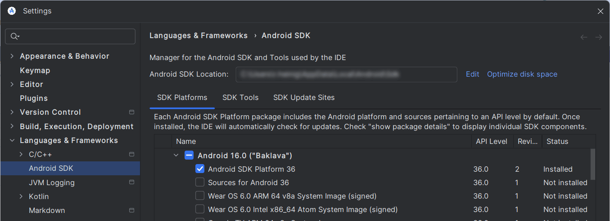
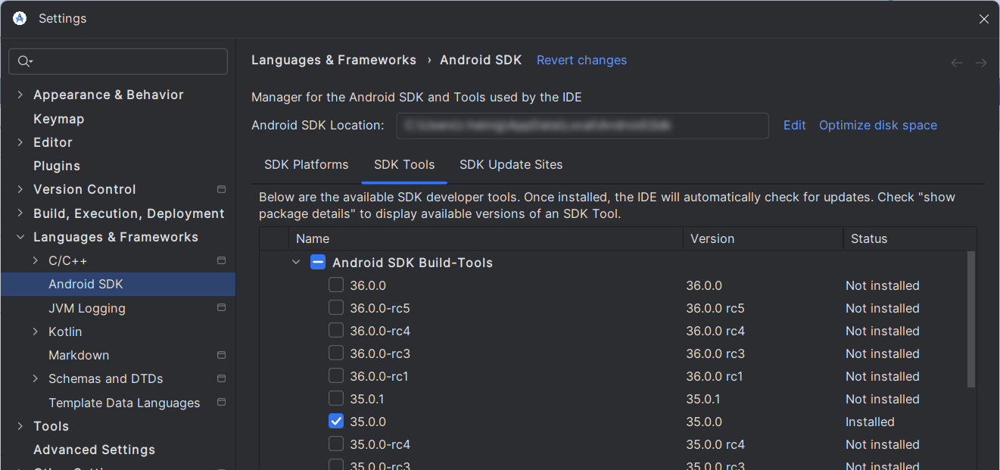

# Building Locally

By the end of this guide, you will have Unciv running locally from code, so you can make changes and test them locally.

## With Android Studio

-   Install [Android Studio](https://developer.android.com/studio) - it's free and awesome! Be aware that it's a long download!
-   Install Git, it's the way for us to work together on this project. UI is optional, Android Studio has good Git tools built in :)
-   Getting the code
    -   Create a [Github account](https://github.com/join), if you don't already have one
    -   [Fork the repo](https://github.com/yairm210/Unciv/fork) - this will create a "copy" of the code on your account, at `https://github.com/<YourUsername>/Unciv`
-   Load the project in Android Studio
    - File -> New -> Project from Version Control -> GitHub
    - Enter your GitHub username and password
    - Select the repository and hit clone - The GitHub repo will be created as a new project in Android Studio.
-   Gradle will attempt the initial sync. If this is your first time with Android Studio, this may require you to accept the Android Build-tools licenses, which works differently on every device, so search for your OS-specific solution.
    -   A new install may not be able to do the initial sync - this comes in the form of `Unable to find method ''void org.apache.commons.compress.archivers.zip.ZipFile.<init>(java.nio.channels.SeekableByteChannel)''` errors when you try to sync. If you have this problem go into File > Settings > Languages & Frameworks > Android SDK
        - Click "SDK Platforms"
        - Click "Android 16.0 ("Baklava")"
          
          (Optionally, you can save some space by selecting 'Show Package Details' and choosing the Platform SDK only, without Sources or system Images)
        - Click "SDK Tools"
        - Select "Show Package Details" in the bottom right
        - Choose version 35.0.0 under "Android SDK Build-Tools"
          
        - Click "Apply"
        - Restart Android Studio
-   Have patience and let the initial Gradle sync finish. The subsequent ones won't take as long. Watch the status bar or the "Build" toolpane. 
-   If everything went well, you will now have three "Run configurations" (look for green in the top bar): "android", "Desktop" and "Run unit tests".
    -   If the "android" one is missing, it's likely your Android SDK setup did not set the ANDROID_HOME environment variable. Do so, restart Studio and re-sync Gradle (the button with the elephant and arrow in the top bar).
    -   If the "Desktop" one is missing, here's how to create one manually:
        -   Select Run > Edit configurations (from main menu or the configurations dropdown)
        -   Click "+" to add a new configuration
        -   Choose "Application"
        -   Give the configuration a name, we recommend "Desktop"
        -   Set the module classpath (the box to the right of the Java selection) to `Unciv.desktop.main` (`Unciv.desktop` for Bumblebee or below), main class to `com.unciv.app.desktop.DesktopLauncher` and `$ProjectFileDir$/android/assets` as the Working directory, OK to close the window
            - It _may_ be useful to set some VM options - activate the field in the run config editor with Alt-V or via the Modify Options menu, then add `-Xmx4096m -Xms256m -XX:MaxMetaspaceSize=256m` to allow a debugged game a little more memory. Or, use the `-DnoLog=` or `-DonlyLog=` options to control console logging. See the [Log.kt](https://github.com/yairm210/Unciv/blob/master/core/src/com/unciv/utils/Log.kt) comments for details.
            - If you get a `../../docs/uniques.md (No such file or directory)` error that means you forgot to set the working directory!
            
    -   If the "Run unit tests" is missing - look for the top-level "tests" folder, right-klick -> Modify Run Configuration...
-   Select the Desktop configuration (or however you chose to name it) and click the green arrow button to run! Or you can use the next button -the green critter with six legs and two feelers - to start debugging.
-   A few Android Studio settings that are recommended:
    - Going to Settings > Version Control > Commit and turning off 'Before Commit - Analyze code'
    - On the same page, we recommend turning off "Use non-modal commit interface". This puts the "Local Changes and "Console" Tabs back into the Git toolpane (and the Shelf once you have shelved diffs). These can be hard to find otherwise - feel free to ignore if you don't think you need them.
    - Settings > Editor > Code Style > Kotlin > Tabs and Indents > Continuation Indent: 4
      
    - Settings > Editor > General > On Save > Uncheck Remove trailing spaces on: [...] to prevent it from removing necessary trailing whitespace in template.properties for translation files
      
    - Right-click the `android/assets/SaveFiles` folder once you have one, "Mark directory as" > Excluded
      - If you download mods do the same for the `android/assets/mods` folder and any other files you may create while testing that do not belong in the public project.
      - This [disables indexing](https://www.jetbrains.com/help/idea/indexing.html#exclude) for performance.

Unciv uses Gradle to specify dependencies and how to run. In the background, the Gradle gnomes will be off fetching the packages (a one-time effort) and, once that's done, will build the project!

Unciv uses Gradle 8.11.1 and the Android Gradle Plugin 8.9.1. Can check in File > Project Structure > Project

> Note: advanced build commands (as described in the next paragraph), specifically `gradlew desktop:dist` to build a jar, run just fine in Android Studio's terminal (Alt+F12), with most dependencies already taken care of.

## Without Android Studio

- Ensure you have JDK 11 or higher installed
- Clone the project (see above initial steps)
- Open a terminal in the Unciv folder and run the following commands

### Windows (CMD)

-   Running: `gradlew desktop:run`
-   Building: `gradlew desktop:dist`

### Linux / macOS / Windows (PowerShell)

-   Running: `./gradlew desktop:run`
-   Building: `./gradlew desktop:dist`

If the terminal returns `Permission denied` or `Command not found` on Mac/Linux, run `chmod +x ./gradlew` first. *This is a one-time procedure.*

If you get an error that Android SDK folder wasn't found, install it by running:

`sudo apt update && sudo apt install android-sdk` (Debian, Ubuntu, Mint etc.)

Then, set the SDK location in the `local.properties` file by adding:

`sdk.dir = /path/to/android/sdk` - for example, `/usr/lib/android-sdk`

If during initial launch you get an error that the JDK version is wrong, install the JDK from [here](https://adoptium.net/temurin/releases/).

> Note: Gradle may take up to several minutes to download files
After building, the output .JAR file should be in `/desktop/build/libs/Unciv.jar`

For actual development, you'll probably need to download Android Studio and build it yourself - see above :)

## Debugging on Android

Sometimes, checking things out on the desktop version is not enough and you need to debug Unciv running on an Android device.
For an introduction, see [Testing android builds](Testing-Android-Builds.md).

## Next steps

Congratulations! Unciv should now be running on your computer! Now we can start changing some code, and later we'll see how your changes make it into the main repository!

Now would be a good time to get to know the project in general at [the Project Structure overview!](Project-structure-and-major-classes.md)

### Unit Tests

You can (and in some cases _should_) run and even debug the unit tests locally.

-   In Android Studio, Run > Edit configurations.
    -   Click "+" to add a new configuration
    -   Choose "Gradle" and name the config, e.g. "Unit Tests"
    -   Under "Gradle Project", choose "Unciv" from the dropdown (or type it), set "Tasks" to `:tests:test` and "Arguments" to `--tests "com.unciv.*"`, OK to close the window.
-   Select the "Unit Tests" configuration and click the green arrow button to run! Or start a debug session as above.

### Linting

Detekt checks for code smells and other linting issues.
To generate Detekt reports:

- Download [detekt-cli](https://github.com/detekt/detekt/releases/latest) (the zip file) and unzip it
- Open a terminal in the Unciv root directory and run one of the following commands to generate the report. NOTE: If you're using Windows, replace `detekt-cli` with `detekt-cli.bat`.
    - For warnings: `PATH/TO/DETEKT/detekt-cli --parallel --report html:detekt/reports.html --config .github/workflows/detekt_config/detekt-warnings.yml`
    - For errors: `PATH/TO/DETEKT/detekt-cli --parallel --report html:detekt/reports.html --config .github/workflows/detekt_config/detekt-errors.yml`
- The report will be generated in `detekt/reports.html`

### Cleaning up obsolete files

From time to time, Unciv bumps the versions of major tools - mainly Gradle, the Android SDK Platform, and the Android SDK Build-Tools.
The new versions and support files are automatically downloaded for you, but old versions are not cleaned up automatically, nor are intermediate build files specific to Gradle versions.
This may leave a few gigabytes of dead files on your system. If these bother you, you can clean up as follows:
 
-   Remove obsolete Android SDK Platform and Build-Tools versions from SDK manager (remember all projects share these, so if you have other projects, keep their requirements too).
-   With Android Studio closed (on Windows, you'll have to manually kill leftover Gradle daemons too):
    - Delete subfolders named after obsolete Gradle versions from Unciv/.gradle, ~/.gradle/caches (%HOME%\.gradle\caches on Windows) and ~/.gradle/daemon
    - For a thorough but more costly cleanup, clean out ~/.gradle/caches entirely except for the tag files.
      This will force the next gradle sync to re-download a large amount of support files, but this way you will also clean out remnants of superseded support libraries for kotlin, Gdx and so on.

Additionally, git prioritizes safety of your changes over efficiency to the extreme, leading to some bloat.
 `git gc` is automatically done for you, but sparingly, and running it manually won't hurt.
For a more thorough cleanup, run `git gc --prune=now --aggressive` sporadically from Studio's terminal (or any shell within Unicv's project folder),
making sure to clean up all your obsolete branches first, and that all remaining branches are in sync with the online branches they're backing
or based on master if they're local only.

### UncivServer

The simple multiplayer host included in the sources can be set up to debug or run analogously to the main game:
-   In Android Studio, Run > Edit configurations.
    -   Click "+" to add a new configuration
    -   Choose "Application" and name the config, e.g. "UncivServer"
    -   Set the module to `Unciv.server.main` (`Unciv.server` for Studio versions Bumblebee or below), main class to `com.unciv.app.server.UncivServer` and `<repo_folder>/android/assets/` as the Working directory, OK to close the window.
-   Select the UncivServer configuration and click the green arrow button to run! Or start a debug session as above.

To build a jar file, refer to [Without Android Studio](#without-android-studio) and replace 'desktop' with 'server'. That is, run `./gradlew server:dist` and when it's done look for /server/build/libs/UncivServer.jar
