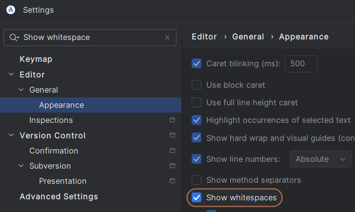

# Coding standards

As an open-source project, there will be a lot of eyes on our code.

The main purpose of having a coding standard is for the code to be as immediately readable as possible to as many potential contributors, and hence most of it focuses on defaulting to coding structures that exist in other similar languages (Java, C#) when possible.

## Remove trailing space before commit (non-Translation)

Trailing spaces are indent characters represented as `..` at the start of line. Android Studio always defaults to create similar indents as previous lines. Thus on attempts to create a blank line (in a code block), it produces trailing space character. Unchecking `Remove trailing spaces on [..]` is necessary for translation part of project but these characters creates annoying code merges.

Settings > Editor > General > Appearence > Check `Show whitespaces` and remove the `..` characters.

## Don't use `.let{}` and `?:`

Kotlin is made greater for being strict with nullability. Don't let this fact confuse people new to it. These can be simply replaced by `if(x!=null)` which is much more readable. They all probably compile to the same bytecode anyway, so when in doubt - readability.

## `for(item in list)` and not `list.forEach{}`

For loops go waaaay back, forEach doesn't. As an added bonus, I'm pretty sure that because forEach accepts a function parameter, then when debugging it won't automatically step into these lines, unlike for.

## Avoid premature abstraction

There's no need to create an interface if there is only one implementation of that interface. Doing so obfuscates the actual code that's running and increases the Time To Relevant Code. If abstraction becomes necessary later, we can always do it later.
