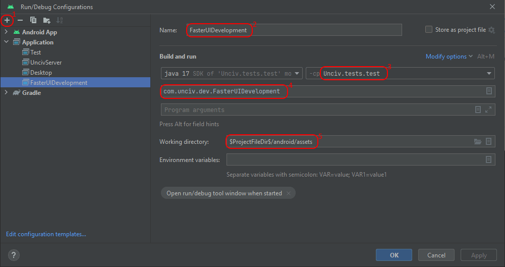

# UI Development

Unciv is backed by [GDX's scene2d](https://libgdx.com/wiki/graphics/2d/scene2d/scene2d) for the UI, so check out [their official documentation](https://libgdx.com/wiki/graphics/2d/scene2d/scene2d) for more info about that.

We mainly use the [`Table` class](https://libgdx.com/wiki/graphics/2d/scene2d/table) of scene2d, because it offers nice flexibility in laying out all the user interface.

## The `FasterUIDevelopment` class

This class is basically just a small helper GDX application to help develop UI components faster.

It sets up the very basics of Unciv, so that you can then show one single UI component instantly. This gives you much faster response times for when you change something, so that you can immediately see the changes you made, without having to restart the game, load a bunch of stuff and navigate to where your UI component would actually be.

To use it, you change the `DevElement` class within the `FasterUIDevelopment.kt` file so that the `actor` field is set to the UI element you want to develop. A very basic usage is there by default, just showing a label, but you can put any UI element there instead.

Once it's up and running, your UI element is centered in the window and gets an orange border. You can toggle Scene2D debugging with the middle mouse button (click the wheel).

Note that the parent your UI element will get doesn't set the size (which in reactive nested layouts would be its responsibility), so if your element is a WidgetGroup like Table, just pack() it. Or ignore the orange dot left over from the border. Also please do not resize the window - there's no support for that at the moment and no guarantees can be given for the results.


```kotlin
class DevElement(
    val screen: UIDevScreen
) {
    lateinit var actor: Actor
    fun createDevElement() {
        actor = "This could be your UI element in development!".toLabel()
    }

    fun afterAdd() {
    }
}
```

You can then simply run the `main` method of `FasterUIDevelopment` to show your UI element.

There's two ways to do so:
* Open this file in Android Studio under project:docs/Developers. That line above has a little green arrow in the left gutter that can be clicked.
* Create a Run Configuration similar to [the desktop one described here](./Building-Locally.md#with-android-studio), but with classpath `Unciv.tests.test` and main class `com.unciv.dev.FasterUIDevelopment`.
  


## The 'Gdx Scene2D debug' option

This option (on the secret 'Debug' page) turns on several UI debug features:
* Gdx Actor debug lines
* Mouse coordinates and FPS
* Descriptor of the Actor under the mouse
* Coordinate scales

### Gdx Actor debug lines
See [Gdx wiki](https://libgdx.com/wiki/graphics/2d/scene2d/table#logical-table)
The Scene2D debug option turns on mouse-over Gdx debug lines at the stage level using `setDebugUnderMouse`, `setDebugTableUnderMouse` and `setDebugParentUnderMouse`.
* Blue lines are Table bounds - Each Table has dimensions as a Widget and as a logical table determined by the cells. They will coincide if there is both expandX and expandY set somewhere.
* Red lines are Cell bounds - the part within cell padding.
* Green lines are Actor bounds of the Cell contents. If the Cell has both Fill directions set, they disappear below the red cell bounds (that is, unless the content Actor has a maxSize limiting the fill).

### Mouse coordinates and FPS
On the bottom right is a semi-transparent panel with 3 numbers on top: X and Y of the mouse in Gdx stage coordinates, and FPS.

### Descriptor of the Actor under the mouse
The lower part of said panel shows a string helping to identify which Actor the mouse is over. This will look for the actor's parent and potentially children, and the optional Actor.name field. Java class names or Label text are used when appropriate - it tries to build something short, but just descriptive enough. It uses the following separators / symbols:
* `:` a colon separates class name from Actor.name - or Actor.name is used undecorated if it contains the class name.
* `"` double-quotes show actual Label or TextButton text, max 20 characters, prefixed directly with the class name.
* `.` a dot separates parent from hit Actor: If the above alone does not yield a descriptive label, the parent (if any) is added as descriptive label per the rules above or as simple class name.
* `(`..`)` after the above designates a sample from the children (the first nicely descriptive one), only if the parent won't add good recognition value.

### Coordinate scales
The bottom and right edges of the screen get tiny tick marks, each 20 units in the Gdx stage coordinates, to help estimate paddings or sizes.
