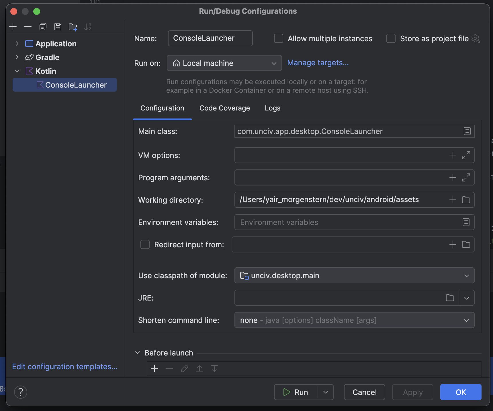

# Simulations

The codebase supports the ability to run automated simulations and compare the results for AI development.

## Enabling

Set up a custom build configuration.

Set the working directory to android/assets, just like when running desktop. And use the `unciv.desktop.main` module.

## Running Sims

Execute the Build Configuration

## Configuring Sims

Within the `desktop\src\ConsoleLauncher.kt` file, you can adjust the number of sims to run, which nations to use, etc.

Recommend using generic civs with no Uniques. You can see the code add a generic `Nation` to the `ruleset` object, and you can key different behavior throughout the code using the Nation Name constant as the control switch.

You can also adjust the game parameters and map parameters. To get more consistent results, turning off Wonders and Barbarians can help.

By default the order of players is randomized to make it more fair.

The `statTurns` parameter allows the system to save certain stats at particular turns so you can track it over the course of the games.

## Understanding Results

By default the console will report the number of wins per civ, type of win, and the `popsum` at the end of the game. This is the average amount of population for the whole civ at the end of the game.

It is a good habit to validate your expectations for which Civ would win, how they would win, and any changes in the reported values. Some changes won't show up in the win rates, so are better tested by making a scenario in the Map Editor or with the in-game Console then testing the AI behaviors.

The p-value is also reported, showing based on the winrate how likely this result is in a binomial test. If this value is very small, then there is a low chance this arose out of random chance and that your changes made a statistically significant change in the overall winrate. Running 200-400 Sims is usually a good baseline point.
