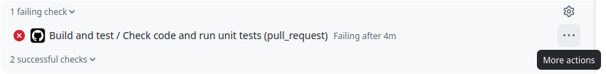

# Translating - for translators

## Starting out

The translation files are at [/android/assets/jsons/translations](https://github.com/yairm210/Unciv/tree/master/android/assets/jsons/translations)

If you're adding a new language, see [Adding a new language](#adding-a-new-language).

If you're adding stuff to an existing language, simply start editing the file!

You don't need to download anything, all translation work can be done on the Github website :)

When you feel that you're ready to add your translation to the game, you'll need to create a merge request, which takes your changes and puts them into the main version of the game - it's pretty straightforward once you do it

Please note that Right-to-Left languages such as Arabic and Hebrew are not supported by the framework :/

## App store text

There are two special entries that won't show in the game but are automatically used to provide short and long descriptions for F-Droid (and possibly other stores soon). They're near the beginning of each language file and marked "Fastlane". See the comments just above each for help, and where to find the actual english original to translate. Do not overlook the note on line breaks in [Other notes](#other-notes) for the full description!

## Pitfalls

-   If a translation template (the stuff to the left of "` = `") contains square brackets, you will have to include each of them _verbatim_ in your translation, but you can move them. Upper/lower case is relevant! e.g. `All [personFilter] are cool` can be translated as `Tous les [personFilter] sont cool`, but ***not*** as `Tous les [personnages] sont cool`, and neither as `Nous sommes vraiment cool`. Failing this is the main cause of your PR's showing up with red "x"es and "checks failed".
-   Blanks: Watch out for blanks at the start of a line or two of them before the equals sign. If you got such a line - those blanks are part of the translation key and must not be deleted on the left side, and you should probably also include them in your translation (unless your language doesn't need spaces to separate things).
-   Changes in the templates: When we find a typo in the english texts and fix it, or marginally change a wording, the template changes. Often the old template will not be automatically fixed in the existing translations, because it's a lot of work _and_ in most cases the developers cannot be sure the translation is still correct. For you, that might look like your translations are simply disappearing with an update. In such a case, you have the option to use github's history to look up old versions, copy the old translation, place it where the new template now says "requires translation" - and proofread and adapt it to the new english version. The history link for each file is in the top right area and has a nice round clock icon.

## Wait, what just happened?

Like most open-source projects, Unciv is developed at Github, so if you don't have a user you'll first have to create one. The way Github works is the following:

1. You create a 'fork' repo, i.e. copy, of Unciv that belongs to your user (myUser/Unciv)
2. You make changes to your copy. These changes are called a 'commit'.
3. You make a pull request, which is basically asking for the changes you made on myUser/Unciv to be merged into the main repo (yairm210/Unciv)

When you ask to 'edit' a file in yairm210/Unciv, these stages happen _automatically_ - but it's important to understand what's happening behind the scenes do you understand where the changes actually are!

## Help! There's a red "x" next to my PR!

Unciv automatically runs unit tests on every PR or push adding commits (inless you're new, in which case someone needs to start the workflows).
These contain checks for the rules already described here - a failure means either you didn't follow all the rules (see [Pitfalls](#pitfalls)), or problems outside your control.

To see what went wrong, open your PR, look for the "failing check" entry under "Some checks were not successful", and click the "..." menu and "View details" (or look for the red "x" near a commit ID and click that).

Scroll a little ways up and look for an entry similar to ' TranslationTests > allTranslationsHaveCorrectPlaceholders FAILED' - the exact explanation is in the lines above and below.

Read and fix all reported errors and commit the fixes. Wait for the checks to re-run, rinse, repeat. You'll learn what it takes to avoid such pitfalls quickly.

## Other notes

Each untranslated phrase will have a ` # Requires translation!" line before it, so you can quickly find them.
You don't need to remove them yourself - they will be automatically removed the next time we rebuild the file.

Do as much as you're comfortable with - it's a big game with a lot of named objects, so don't feel pressured into doing everything =)

If you're making changes to your own repo, make sure that you make the branch you're changing is based on Unciv's master branch

Some entries have line breaks expressed as `\n`: Your translation can and in most cases should use them as well, but you do not need to distribute them exactly as in the original. Try to find a translation that reads nicely, then place the line break codes at roughly the same intervals as the original uses (less if your language's glyphs are wider than latin ones). Important: You cannot use normal line breaks, you must use the `\n` codes, normal line breaks are not part of a translation.

Chinese tutorial: 如果你是中国人，那么恭喜你运气不错！这里有Unciv中文开发者们专门为中文翻译工作者准备的（十分详尽）教程视频。：[(Video On Bilibili)](https://www.bilibili.com/video/BV1pY4y1u7WH/)

## Adding a new language

If any of the following steps are beyond your skillset, ask for help. All but the first two steps can be postponed.

- You'll need to create a new file ('Create a new file' to the right of the folder name in the UI), and copy into it the contents of template.properties
- For automatic language processing for a release (e.g. adding new templates) there needs to exist a line in [completionPercentages.properties](https://github.com/yairm210/Unciv/tree/master/android/assets/jsons/translations/completionPercentages.properties). Location and number do not matter, what matters is that the language name left of the ` = ` corresponds exactly with your new language file name, case-sensitive, without extension.
- For a nice display in language picker and options, we need a flag. It should be a circle surrounded by transparency within a 128x128px square. Add such a png to [FlagIcons](https://github.com/yairm210/Unciv/tree/master/android/Images.Flags/FlagIcons). For potential sources, look in the [credits](https://github.com/yairm210/Unciv/tree/master/docs/Credits.md), and when done, add your source unless it is already covered.
- A new graphic needs to be converted into the texture atlases (see [Images and the texture atlas](../Modders/Images-and-Audio.md#images-and-the-texture-atlas)) - for a new flag, this usually means running the desktop version once from source, then uploading the updated atlas files via push or manually.
- Lastly, your new language should be represented in the [LocaleCode](https://github.com/yairm210/Unciv/tree/master/core/src/com/unciv/models/metadata/GameSettings.kt#L261) enum - reasons see below. You can add this even if you cannot compile - just make sure you follow the existing pattern, and read the inline documentation.
- The first function of this entry is alphabetical sorting. Unfortunately, it is not easy to tell whether a specific combination is supported by Java. The simplest way to deal with this is trial and error - once your language is established and playable, see if Civilopedia entries seem properly sorted, if not, open an issue and tell us what _other_, more common language may have better sorting rules.
- This entry is also required to enable fastlane description upload to a correct folder - however, whether F-Droid supports your language is not guaranteed ([this page](https://f-droid.org/docs/Translation_and_Localization/) should help - but doesn't).

## Diacritics support

When displaying text, the underlying libraries (libGdx and possibly lwjgl3/GWT) that Unciv uses assume one codepoint in the [UTF-16](https://en.wikipedia.org/wiki/UTF-16) representation corresponds to one rendered glyph,
which causes incorrect display of languages making heavy use of diacritics or of characters outside the [basic multilinguial plane](https://en.wikipedia.org/wiki/Plane_(Unicode)#Basic_Multilingual_Plane) like most emoji.
A language file can activate a "trick", where combinations of codepoints that should render as one single glyph are mapped into a "fake alphabet",
which is created on the fly in the [Private Use Area](https://en.wikipedia.org/wiki/Private_Use_Areas) defined by Unicode.

To activate this feature, set `diacritics_support = true` in your translation. There are a few additional "settings" - translation lines where the "translation" is some control instruction instead.
All of these are optional, though your language may show glitches unless you define some. For example, Bangla _needs_ a definition for U+09CD, where the Unicode category does not fully define the required behaviour.

Each of the following definitions represents zero or more characters, and can simply list them as one string.
For readability, they can also be quoted (" surrounding the entire definition), characters can be separated by spaces, or you can use standard "U+xxxx" representations (these need space separators).
These entries, unlike the rest of a translation file, also support entry-specific comments: After the code(s), from a '#' to the end of the line.
Search for the information about the Unicode support in your language, e.g. on https://www.unicode.org/charts/ for information on which codes you might need to specify.
If your language does not need these, feel free to ignore, or use "" to avoid the "requires translation" mark.

### Limitations
- Consider this feature as being in an experimental stage.
- Can only work if the language's script still consists of individual glyphs rendered left to right.
- The underlying libraries (Java AWT or Android) must be able to render the combinations you need - sometimes you will need to select and possibly install a specific font to see the intended results.
- Using diacritics support incurs a performance penalty, but mostly when loading languages starting Unciv.
- The feature also has a "quantity" limitation from the size of the Unicode "Private Use Area" (only the one in the BMP can be used), and this must be shared by the feature whereby Unciv automatically displays ruleset object icons:
  The total number of distinct diacritic "combinations" (or glyphs) your translation actually uses plus the number of objects in the loaded mods (or vanilla ruleset) must not exceed 6400.
- When enabled and the range is the default (or spans the unicode range for surrogates), then the engine will treat Unicode surrogate pairs correctly, assigning a fake alphabet codepoint for them and allowing diacritics to include them in a combo.
  However, the parser is strict and throws an Exception on violations of the UTF-16 standard. If your translation crashes Unciv, check your editor for incorrect Unicode handling
  (translation files are UTF-8 not UTF-16, but unfortunately most encoding converters allow transferring mismatched surrogate pairs).
  Also, this possibility could so far not be successfully tested for emoji - no supporting font found, see "experimental".

### Settings (as translation entries in the language file)
- `diacritics_support`: This entry must be set to "true" for the diacritics support to work at all. Any other value will cause text to be passed through unchanged.
- `unicode_block_start_character` and `unicode_block_end_character`: These define the range of characters that should be considered. One character or code each. Defaults to the entire BMP range.
  All characters in this range will be categorized, those undefined by Unicode, controls or punctuation, or those outside the range will pass through and reset the diacritics engine for the rest of the line, that is, pending potential combinations will be flushed.
  Limiting this range - e.g. to the Unicode page dedicated to your language - is a performance optimization, but ultimately not required.
- `left_joining_diacritics`: Optionally define additional codes meant to join with the character to the left of them, by default the unicode categories "Mn" and "Mc" within the range described above are used.
- `right_joining_diacritics`: Optionally define additional codes meant to join with the character to the right of them, by default none.
- `left_and_right_joiners`: Optionally define additional codes meant to join with the character to the left AND with the character to the right, by default none

These are processed in listed order and can override previous categorizations per character codepoint.
Thus a code specified in `left_and_right_joiners` can be in the "Mn" unicode category, which would put it into the `left_joining_diacritics`, but will still work, because the later definition overrides the earlier one.

## Why not use a crowdsourcing translation website like <...>?

1. Testing. Currently, translations undergo a number of tests for verification. This allows some language changes to be accepted and others not, and it's all in the same platform with the same tests. External translation tools don't allow for this.
2. History and revisions. This is what Git was made for, and nothing like it exists in the world. I'm not exaggerating.
3. Release cycle. We release versions weekly. If we need to take information from an external website every time, and for many that I've checked - you need to download the info as a csv or something and convert it. Every extra step hurts.
4. Discussions. Most crowdsourcing translation websites don't allow for discussions and corrections on translations. Github does.
5. Mass changes. If we're changing the source of the translation but want to keep the various destinations (say, we change "Gold from trade routes +[amount]%" to "+[amount]% Gold from trade routes"), if all the translation files are in Git we can do that in 1 minute. If it's external, this varies greatly.
